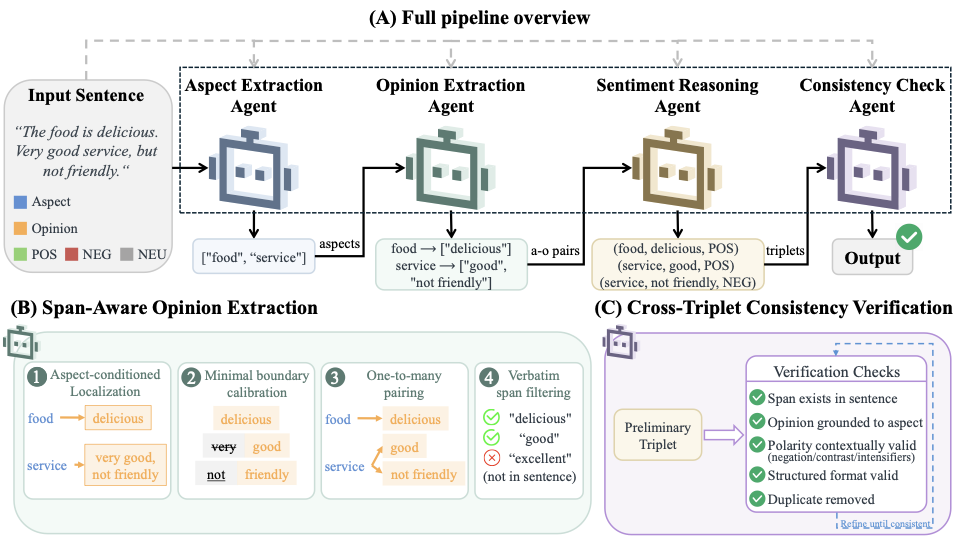

# MASTE: Multi-Agent Pipeline for Zero-Shot Aspect Sentiment Triplet Extraction

This repository contains the official implementation of MASTE, a training-free multi-agent framework for zero-shot Aspect Sentiment Triplet Extraction (ASTE).

MASTE decomposes ASTE into four lightweight LLM agents and requires no task-specific training, enabling zero-shot triplet extraction out of the box.

<div align="center">
    
</div>

---

## 📰 Updates
- **`2026-06-12`**: Codebase is publicly available.

## 🎯 Getting Started

### Installation

#### 1. Create Virtural Environment
We recommend using Python 3.10 and venv for environment management(Similar goes for conda environment).
```bash
python -m venv .venv
source .venv/bin/activate
pip install -r requirements.txt
```

#### 2. Configure an OpenAI-compatible API :

```bash
export OPENAI_API_KEY=sk-...

# Use official or another OpenAI-compatible provider
export OPENAI_BASE_URL=...
```

### Data Preparation

The experiment scripts expect ASTE-Data-V2 files under:

```text
data/aste/SemEval-Triplet-data/ASTE-Data-V2-EMNLP2020/
```

The expected domain folders are:

```text
14res/
14lap/
15res/
16res/
```

Each folder should contain the corresponding `train_triplets.txt`, `dev_triplets.txt`, and `test_triplets.txt` files. The dataset is not included in this repository; please obtain it from the original ASTE benchmark release and place it at the path above.

## Run Experiments

- Single domain (MASTE):

```bash
PYTHONPATH=. python experiments/run_main.py \
  --method maste \
  --model gpt-4o \
  --domains 14res \
  --split test \
  --output_dir results/maste_gpt4o
```

- All four domains (MASTE):

```bash
PYTHONPATH=. python experiments/run_main.py \
  --method maste \
  --model gpt-4o \
  --domains 14res 14lap 15res 16res \
  --split test \
  --output_dir results/maste_gpt4o
```

- Single-call zero-shot baseline:

```bash
PYTHONPATH=. python experiments/run_main.py \
  --method zero_shot \
  --model gpt-4o \
  --domains 14res 14lap 15res 16res \
  --split test \
  --output_dir results/zero_shot_gpt4o
```

- Chain-of-thought baseline:

```bash
PYTHONPATH=. python experiments/run_main.py \
  --method cot \
  --model gpt-4o \
  --domains 14res 14lap 15res 16res \
  --split test \
  --output_dir results/cot_gpt4o
```

- Ablation study:

```bash
PYTHONPATH=. python experiments/run_ablation.py \
  --model gpt-4o \
  --domain 14res \
  --split test \
  --output_dir results/ablation/gpt4o_14res
```

## Output Format

Each experiment writes one JSON file per domain and a `summary.json` file under the specified output directory. Per-domain files contain the original sentence, gold triplets, predicted triplets, and exact-match evaluation metrics.


## Repository Structure

```text
src/
  agents/
    aspect_agent.py       # Aspect extraction agent
    opinion_agent.py      # Opinion extraction agent
    sentiment_agent.py    # Sentiment reasoning agent
    consistency_agent.py  # Consistency checking agent
  baselines.py            # Zero-shot, few-shot, direct, and CoT baselines
  data_loader.py          # ASTE dataset loader
  evaluate.py             # Exact-match precision, recall, and F1
  llm_client.py           # OpenAI-compatible LLM client
  pipeline.py             # MASTE pipeline orchestration

experiments/
  run_main.py             # Main experiment entry point
  run_ablation.py         # Ablation experiment entry point

requirements.txt
```

Local test files, paper sources, datasets, generated results, logs, and paper-writing helper scripts are intentionally excluded from the public release.


## Citation

If you use this code, please cite our paper. We will provide the final BibTeX after the arXiv version is available.

```bibtex
@misc{maste_arxiv_tba,
  title        = {MASTE: A Multi-Agent Pipeline for Zero-Shot Aspect Sentiment Triplet Extraction},
  author       = {To be updated},
  year         = {2026},
  eprint       = {arXiv:XXXX.XXXXX},
  archivePrefix= {arXiv},
  primaryClass = {cs.CL}
}
```